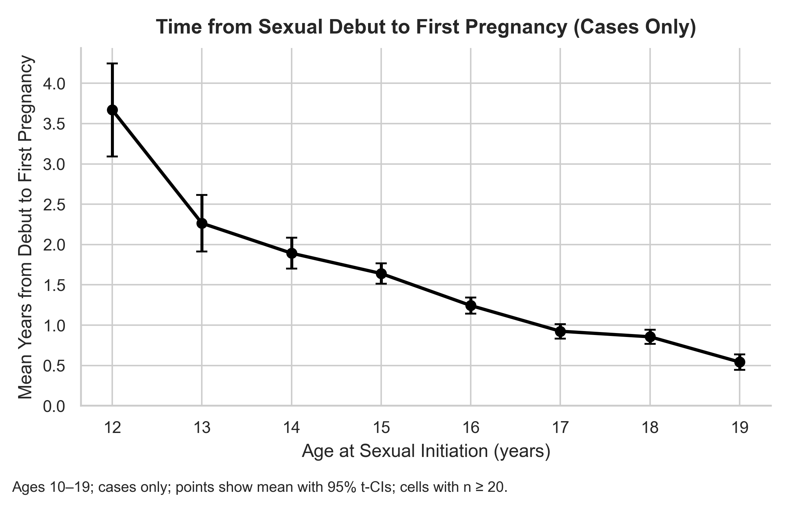
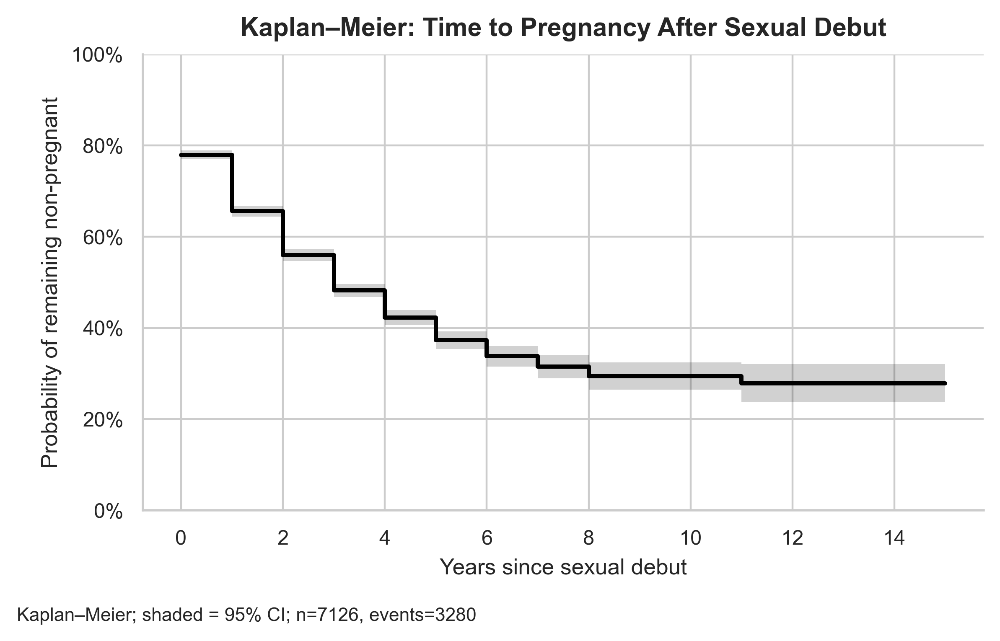
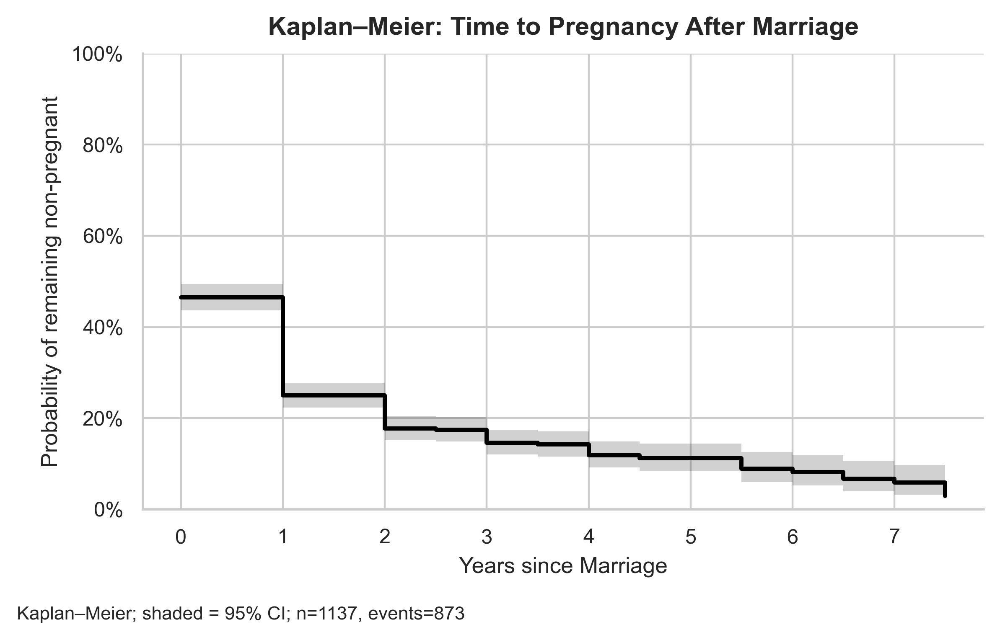
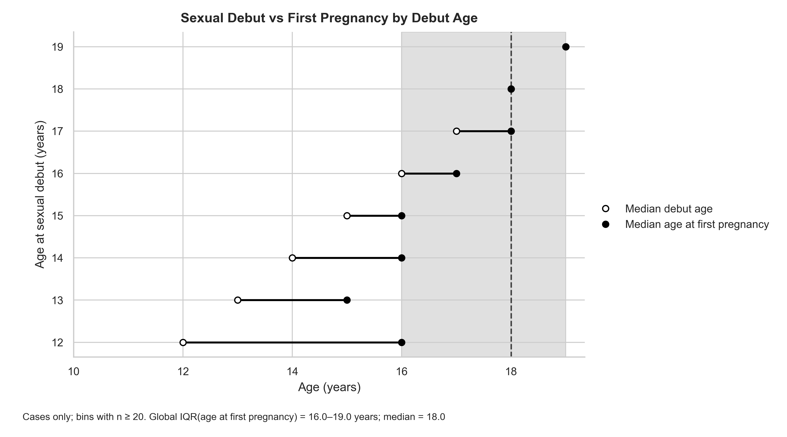

# Statistical Modelling of Teenage Pregnancy Determinants in Uganda

---

## Overview
This repository contains the statistical modelling and data analysis supporting the paper:

**"How much of a change in proximal determinants of adolescent pregnancy is needed to reduce teenage pregnancies in Uganda?  
A decomposition analysis of the 2018 and 2023 Adolescent Girls and Young Women Survey Data."**

The analysis examines the extent to which changes in *proximal determinants*—such as **schooling status, age at sexual debut, marriage timing, and contraceptive use**—contribute to reductions in teenage pregnancy in Uganda.

---

## Background
Teenage pregnancy remains a significant social and public health issue in Uganda. According to the 2022 Uganda Demographic and Health Survey (UDHS), **23.5% of women aged 15–19 had initiated childbearing**, with marked disparities by education level, residence, and region.

While many studies describe associated factors, few quantify how much improvement in these determinants could reduce adolescent pregnancy. This analysis uses decomposition and regression methods to assess the contribution of key factors driving teenage pregnancy among adolescent girls and young women (AGYW) in Uganda.

---

## Data Source
The analysis uses data from the **2018 and 2023 Adolescent Girls and Young Women (AGYW) Survey**, conducted across 20 districts by **Makerere University School of Public Health (MakSPH)** and partners. The corresponding survey questionnaire is in `additional/survey_outline.pdf`.

### Sampling Design
- **Population:** Adolescent girls and young women aged 10–24 years (N = 8,473)
- **Sampling Frame:** 233 villages and 80 schools in 20 purposively selected districts
- **Stratification:** In-school and out-of-school participants
- **Variables:** Socio-demographic characteristics, reproductive health, sexual behaviour, contraceptive use, pregnancy history, and household vulnerability

---

## Repository Structure

```
.
├── data/
│   ├── AGYW_dataset_2018.dta          # Raw 2018 survey data (Stata format)
│   ├── AGYW_dataset_2023.dta          # Raw 2023 survey data (Stata format)
│   ├── processed_df_2018_aligned.csv  # Processed 2018 data (output of src/process_2018.py)
│   └── processed_df_2023_aligned.csv  # Processed 2023 data (output of src/process_2023.py)
│
├── src/
│   ├── process_2018.py      # Cleans and recodes the 2018 raw data
│   ├── process_2023.py      # Cleans and recodes the 2023 raw data
│   ├── processing_utils.py  # Shared helper functions used by both processing scripts
│   └── utils.py             # Analysis helpers (CI calculations, model utilities, plot helpers)
│
├── notebooks/
│   ├── 01_processing.ipynb  # Exploratory / legacy processing notebook
│   ├── 02_analysis.ipynb    # Main analysis notebook (figures, models, decomposition)
│   └── other/               # Older exploratory notebooks (not part of main pipeline)
│
├── results/                 # Output figures (written by 02_analysis.ipynb)
├── tests/                   # Unit tests for processing utility functions
├── additional/
│   ├── survey_outline.pdf   # AGYW survey questionnaire
│   └── AGYW pregnancy notes.Rmd
├── paper/                   # Paper drafts
│
├── config.yaml              # Plot settings, age thresholds, valid school statuses
├── requirements.txt         # Python package dependencies
└── Makefile                 # Common workflow commands
```

---

## Getting Started

### 1. Install dependencies

```bash
make install
# equivalent to: pip install -r requirements.txt
```

Requires **Python 3.10+**.

### 2. Process the raw data

```bash
make process
```

This runs `src/process_2018.py` and `src/process_2023.py` from the repo root and writes the processed CSVs to `data/`. These files are the inputs to the analysis notebook.

### 3. Run the analysis

Open `notebooks/02_analysis.ipynb` in Jupyter and run all cells. The notebook:

- Loads `data/processed_df_2018_aligned.csv` and `data/processed_df_2023_aligned.csv`
- Reads plot and analysis parameters from `config.yaml`
- Imports helper functions from `src/utils.py`
- Produces all figures saved to `results/`

### 4. Run tests

```bash
make test
```

Unit tests cover the processing utility functions in `src/processing_utils.py`.

---

## Configuration

`config.yaml` controls key parameters used across the pipeline:

| Section | Parameters |
|---------|-----------|
| `paths` | Directories for input data and output figures |
| `age` | Age range (10–24), adolescent cutoff (≤19) |
| `plot` | Figure size, font size, line width, minimum group N |
| `data` | Valid school status labels, contraceptive method columns |

---

## Analytical Approach

The notebook applies both **descriptive and inferential statistical analyses** in Python.

**Analytical methods include:**
- Descriptive statistics: frequencies, proportions, cross-tabulations
- Chi-square tests for group comparisons
- Binary logistic regression to assess associations between teenage pregnancy and explanatory factors
- Kaplan-Meier survival analysis to estimate time to first pregnancy following sexual debut
- Decomposition analysis to determine the contribution of proximal determinants (education, marriage, contraception, sexual debut) to overall reductions in teenage pregnancy

---

## Key Variables

| Category | Example Variables |
|----------|------------------|
| Socio-demographic | Age, residence (rural/urban), district |
| Education | Schooling status (in-school, completed, dropped out), highest level completed |
| Sexual behaviour | Age at sexual debut, willingness, partner type |
| Contraception | Use at first sex, type of method |
| Marriage | Marital status, age at marriage, married by 19 |
| Wealth | Household asset-based tertiles (PCA-derived) |

---

## Outputs

Selected visualizations from the analysis (available in `results/`):

**1. Mean Time to Pregnancy by Age at Sexual Debut**  
Shows how the average time from sexual debut to first pregnancy shortens with earlier sexual initiation.  


**2. Kaplan–Meier Curve: Time to Pregnancy After Sexual Debut**  
Estimates the probability of remaining non-pregnant over time after sexual initiation.  


**3. Kaplan–Meier Curve: Time to Pregnancy After Marriage**  
Shows cumulative probability of pregnancy following marriage among adolescent girls.  


**4. Global Dumbbell Plot: Sexual Debut vs. Pregnancy Timing**  
Compares mean ages at sexual debut and at first pregnancy, illustrating exposure windows and interquartile ranges.  


---

## Tools and Packages

Developed using **Python 3.10+** with the following libraries:

- `pandas`
- `numpy`
- `matplotlib`
- `seaborn`
- `statsmodels`
- `lifelines`
- `scipy`
- `scikit-learn`
- `PyYAML`
- `pytest`

---

## Funding Acknowledgement

This study was supported by a **grant from the Global Fund through The AIDS Support Organization (TASO)**  
(**Grant#: UGA-C-TASO-1449**) awarded to **Makerere University School of Public Health** to conduct formative research on HIV, sexual and reproductive health, and gender-based violence among adolescent girls and young women in Uganda.

---

## Citation

If using or referencing this work, please cite:

> Matovu, J.K.B., Minnitt, N.J., et al. (in preparation).  
> *How much of a change in proximal determinants of adolescent pregnancy is needed to reduce teenage pregnancies in Uganda?*  
> Makerere University School of Public Health.

---

## License

This repository is made available for academic and non-commercial use.  
Please credit the authors and **Makerere University School of Public Health** when reproducing content or analytical methods.

---
